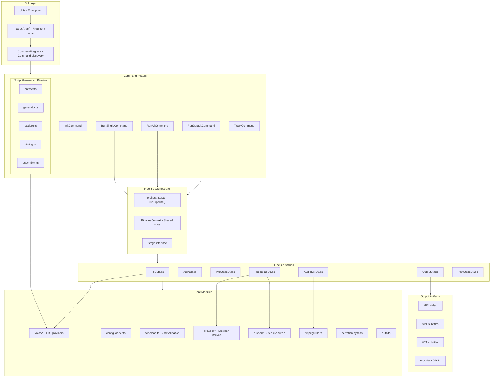

# demo-reel Architecture

## Overview

demo-reel is a CLI tool that creates professional demo videos from web applications. Users write scripts in TypeScript (`.demo.ts` files), the tool uses Playwright to automate a browser, records the video, generates voiceover narration via TTS, and outputs MP4 videos + SRT/VTT subtitles + scene metadata.

## High-Level Architecture



## Directory Structure

```
src/
├── pipeline/              # Pipeline orchestration (NEW)
│   ├── context.ts         # PipelineContext — mutable bag shared across stages
│   ├── types.ts           # Stage interface
│   └── orchestrator.ts    # runPipeline() — composes and runs stages
│
├── stages/                # Pipeline stage implementations (NEW)
│   ├── tts.ts             # Generate voiceover audio
│   ├── sync.ts            # Optional: align step timing via estimates
│   ├── auth.ts            # Login + session management
│   ├── pre-steps.ts       # Run pre-steps in setup browser
│   ├── recording.ts       # Launch browser, run demo, record video
│   ├── audio-mix.ts       # FFmpeg merge audio+video, auto-shift overlaps
│   ├── output.ts          # Write subtitles, metadata, finalize
│   └── post-steps.ts      # Run cleanup steps
│
├── browser/               # Browser lifecycle management (NEW)
│   ├── pool.ts            # BrowserPool — manages browser lifecycle
│   ├── launcher.ts        # Launch/stop recording
│   └── types.ts           # BrowserSession
│
├── ffmpeg/                # Single FFmpeg wrapper (NEW)
│   └── utils.ts           # Merge audio-processor + script/tts.ts wrappers
│
├── runner/                # Step execution (extracted from runner.ts)
│   ├── index.ts           # runDemo(), runSteps(), runScenarioForTest()
│   ├── cursor.ts          # Cursor overlay DOM injection
│   ├── motion.ts          # Bezier mouse movement
│   ├── typing.ts          # Human-like typing
│   ├── steps.ts           # runStep() — all 17 action types
│   ├── step-simple.ts     # runStepSimple() — fast no-cursor version
│   ├── assertions.ts      # All assert* actions
│   ├── selectors.ts       # resolveLocator, resolveLocatorAll
│   ├── scene-tracking.ts  # Scene boundaries + timestamp building
│   └── types.ts           # MouseState, Point, SceneTimestamp
│
├── voice/                 # TTS provider system (extracted from script/tts.ts)
│   ├── index.ts           # TTSProvider interface + registry
│   ├── piper.ts           # Piper provider (moved from src/piper.ts)
│   ├── openai.ts          # OpenAI provider
│   ├── elevenlabs.ts      # ElevenLabs provider
│   ├── cache.ts           # Voice caching
│   └── types.ts           # VoiceSegment, etc.
│
├── commands/              # Command pattern CLI
│   ├── index.ts           # Re-exports
│   ├── types.ts           # Command, CommandContext, GlobalOptions
│   ├── registry.ts        # CommandRegistry
│   ├── init.ts            # InitCommand
│   ├── track.ts           # TrackCommand
│   └── run/               # Run commands
│       ├── single.ts      # RunSingleCommand
│       ├── all.ts         # RunAllCommand
│       └── default.ts     # RunDefaultCommand
│
├── script/                # AI script generation pipeline (unchanged)
│   ├── index.ts           # Re-exports
│   ├── crawler.ts         # Web crawler for selector discovery
│   ├── generator.ts       # AI-powered script generation
│   ├── explorer.ts        # App exploration via Playwright
│   ├── timing.ts          # Step duration estimation
│   ├── assembler.ts       # Build .demo.ts from script
│   ├── tts.ts             # TTS generation (uses voice/ providers)
│   └── types.ts           # DemoScript, TimedScene, etc.
│
├── index.ts               # Thin: exports + defineConfig + generate()
├── cli.ts                 # Thin: parse args → registry dispatch
├── schemas.ts             # Barrel re-export → src/schemas/
├── schemas/               # Zod validation schemas (split from monolithic schemas.ts)
├── config-loader.ts       # Config loading (.ts/.json)
├── narration-manifest.ts  # Narration manifest data format
├── narration-sync.ts      # Audio-first step timing sync
├── auth.ts                # Session capture/restore/validate
├── audio-processor.ts     # FFmpeg audio/video merging (→ ffmpeg/)
├── voice-config.ts        # Voice config resolution
├── presets.ts             # Motion/typing/cursor/timing presets
├── random.ts              # Seeded random number generator
├── run.ts                 # Programmatic API entry
├── interfaces.ts          # WriteFile interface
└── types.ts               # Public type re-exports
```

## Layer Boundaries

```
┌──────────────────────────────────────────┐
│              CLI Entry Layer              │
│  cli.ts, parseArgs(), runCli()           │
│  → Dispatches to CommandRegistry          │
├──────────────────────────────────────────┤
│            Command Pattern Layer          │
│  RunSingle, RunAll, RunDefault, Init,     │
│  Track, ScriptRouter                      │
│  → Orchestrate pipeline composition       │
├──────────────────────────────────────────┤
│          Pipeline Orchestrator Layer      │
│  PipelineContext, Stage, runPipeline()    │
│  → Sequential stage execution             │
├──────────────────────────────────────────┤
│           Pipeline Stages Layer           │
│  TTS → Auth → PreSteps → Recording        │
│  → AudioMix → Output → PostSteps          │
│  → Each stage reads/writes PipelineContext │
├──────────────────────────────────────────┤
│            Core Domain Layer              │
│  schemas, runner/*, browser/*, ffmpeg/*,  │
│  voice/*, auth, narration-sync            │
│  → Pure logic, no orchestration           │
├──────────────────────────────────────────┤
│          Infrastructure Layer             │
│  config-loader, narration-manifest,       │
│  presets, random, voice-config            │
│  → Cross-cutting utilities                │
└──────────────────────────────────────────┘
```

## Dependency Flow

```mermaid
flowchart LR
    subgraph Entry
        CLI[cli.ts]
        RUN[run.ts]
    end

    subgraph Orchestration
        GENERATE[index.ts :: generate()]
        PIPELINE[pipeline/orchestrator.ts]
    end

    subgraph Stages
        S1[TTSStage]
        S2[AuthStage]
        S3[PreStepsStage]
        S4[RecordingStage]
        S5[AudioMixStage]
        S6[OutputStage]
        S7[PostStepsStage]
    end

    subgraph Core
        VOICE_MOD[voice/*]
        SYNC_MOD[narration-sync.ts (optional)]
        AUTH_MOD[auth.ts]
        RUNNER_MOD[runner/*]
        BROWSER_MOD[browser/*]
        FFMPEG_MOD[ffmpeg/*]
    end

    CLI --> GENERATE
    RUN --> GENERATE
    GENERATE --> PIPELINE
    PIPELINE --> S1 --> S2 --> S3 --> S4 --> S5 --> S6 --> S7

    S1 --> VOICE_MOD
    S2 --> AUTH_MOD
    S3 --> RUNNER_MOD
    S3 --> BROWSER_MOD
    S4 --> BROWSER_MOD
    S4 --> RUNNER_MOD
    S5 --> FFMPEG_MOD
    S6 -.-> OUTPUT[(Output Files)]

    style PIPELINE fill:#e1f5fe
    style GENERATE fill:#fff3e0
```

## Key Design Decisions

### 1. Pipeline Context (shared mutable bag)

All stages communicate through a single `PipelineContext` object — no temp files, no global state, no side-channel communication between stages. Each stage reads what it needs from context and writes back its results.

### 2. Stage interface as boundary

```ts
interface Stage {
  readonly name: string;
  run(ctx: PipelineContext): Promise<void> | void;
}
```

Every stage is independently testable — just provide a mock `PipelineContext` with the fields that stage needs.

### 3. Command registry for CLI dispatch

CLI entry point parses args, finds a command in the registry, and calls `execute()`. Commands own their pipeline composition. The registry is the single source of truth for available operations.

### 4. Single FFmpeg wrapper

Both `audio-processor.ts` and `script/tts.ts` had their own `getFfmpegPath()` / `runFFmpeg()` / `runFfprobe()` implementations. One shared `ffmpeg/utils.ts` eliminates the duplication.

### 5. Runner split by concern

The 1392-line `runner.ts` splits into focused files: cursor overlay, bezier motion, typing simulation, step execution (with and without cursor), assertions, selectors, and scene tracking. Each file has one clear responsibility.
