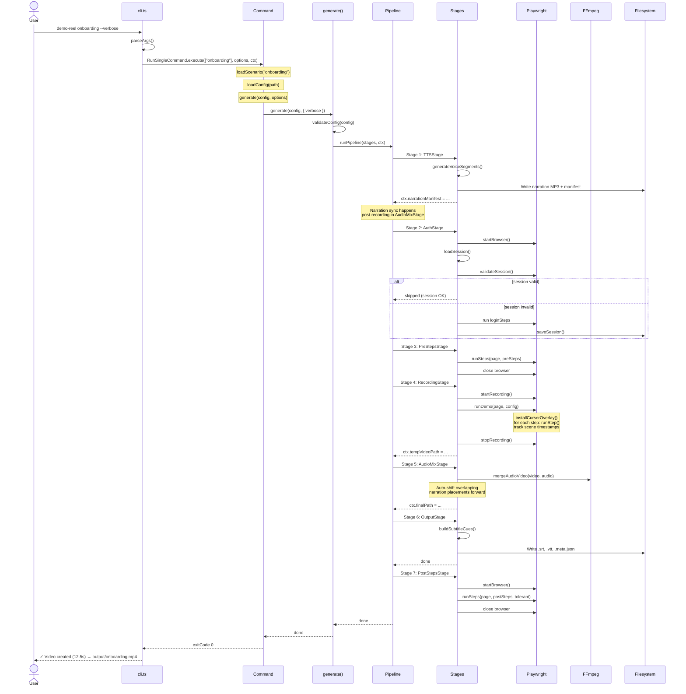
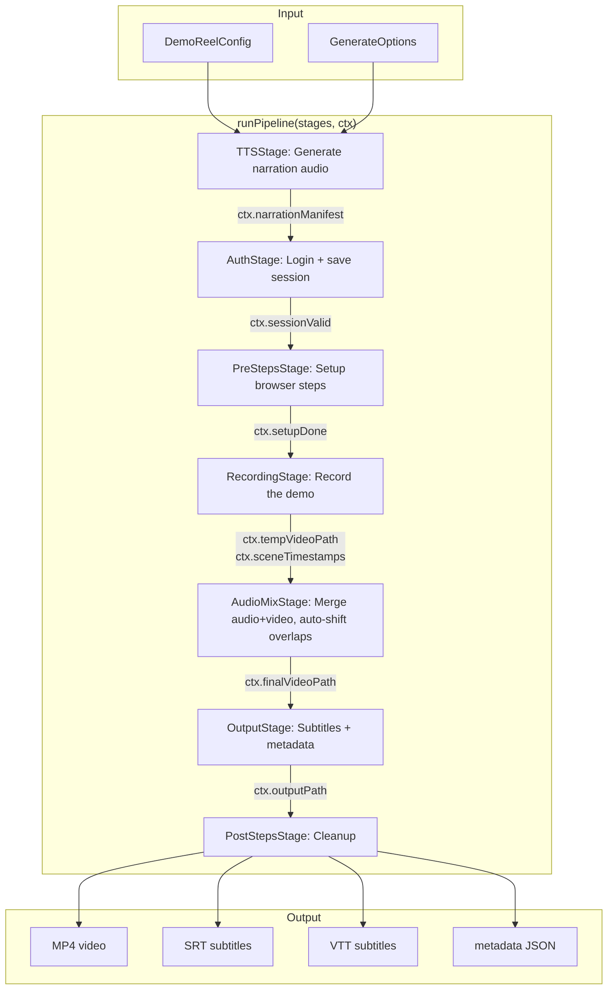
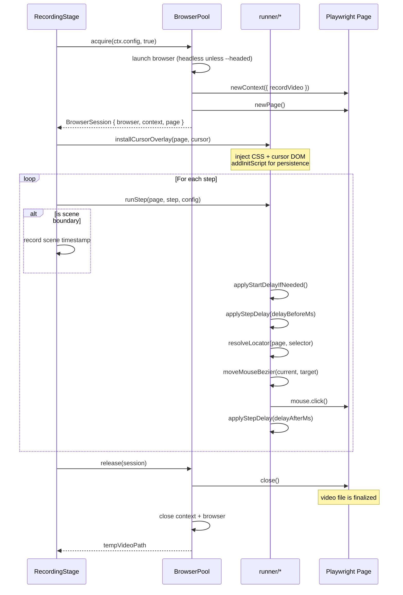
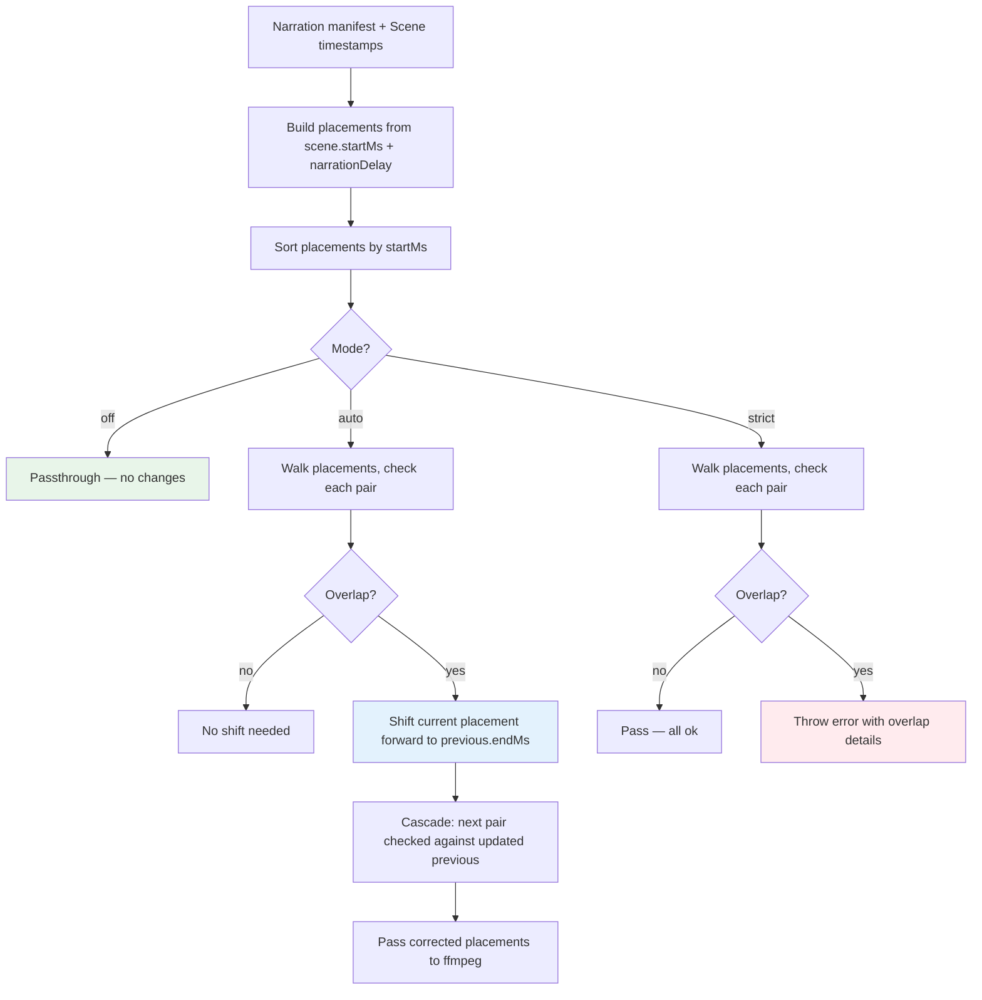

# Execution Flows

## End-to-End Flow



## CLI Dispatch Flow

```mermaid
flowchart TD
    A[main()] --> B[parseArgs()]
    B --> C{Command?}

    C -->|--help| D[showHelp() → exit 0]
    C -->|init| E[InitCommand]
    C -->|track| F[TrackCommand]
    C -->|script| G[ScriptRouterCommand]
    C -->|--all| H[RunAllCommand]
    C -->|scenario name| I[RunSingleCommand]
    C -->|no args| J[RunDefaultCommand]

    E --> K[registry.find(['init']) → execute()]
    F --> L[TrackCommand.execute()]
    G --> M[ScriptRouterCommand.execute()]
    H --> N[RunAllCommand.execute()]
    I --> O[RunSingleCommand.execute()]
    J --> P[RunDefaultCommand.execute()]

    H --> Q[findScenarioFiles() → for each: loadConfig → runScenario()]
    I --> R[loadScenario(name) → loadConfig(path) → runScenario()]
    J --> S[findScenarioFiles() → if one: runScenario(); if many: error]

    N --> T{shouldGenerateVoice?}
    T -->|yes| U[generate(config)]
    T -->|no| V[runVideoScenario(config)]
```

## Pipeline Stage Flow (New Architecture)



## RecordingStage Internal Flow



## Voice Generation Flow

```mermaid
flowchart TD
    A[DemonReelConfig with voice + narration] --> B{TTS Provider?}
    B -->|piper| C[ensurePiperBinary() + ensurePiperModel()]
    B -->|openai| D[OpenAI TTS API]
    B -->|elevenlabs| E[ElevenLabs TTS API]

    C --> F[Piper CLI: text → WAV]
    D --> G[OpenAI API: text → audio buffer]
    E --> H[ElevenLabs API: text → audio buffer]

    F --> I{Has pronunciation overrides?}
    G --> I
    H --> I

    I -->|yes| J[Run text replacements]
    I -->|no| K[Generate raw audio]

    J --> L[Cached by content hash?]
    K --> L

    L -->|yes| M[Load from cache]
    L -->|no| N[Generate + cache]

    M --> O[concat WAV files via FFmpeg → MP3]
    N --> O

    O --> P[Write narration-manifest.json]
    P --> Q[ctx.narrationManifest = ...]
```

## Narration Auto-Shift Flow (Post-Recording)



The default pipeline uses **post-recording auto-shift** instead of the legacy estimate-based
step-padding engine (`narration-sync.ts`). Overlaps are detected from real recorded timestamps,
and narration placements are shifted forward to eliminate overlaps. Subtitles and metadata
use the corrected placements.
